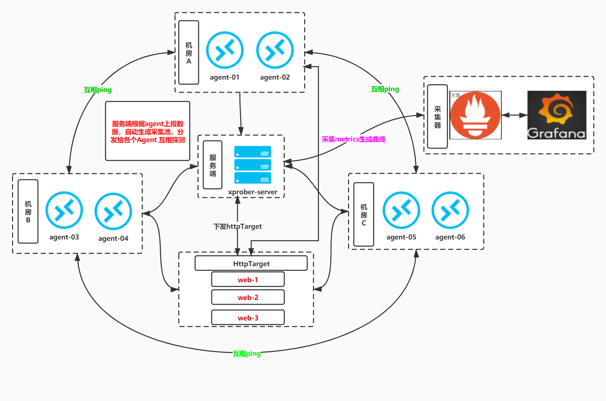

# k8s教程说明
- [k8s底层原理和源码讲解之精华篇](https://ke.qq.com/course/4093533)
- [k8s底层原理和源码讲解之进阶篇](https://ke.qq.com/course/4236389)

# prometheus全组件的教程

- [01_prometheus全组件配置使用、底层原理解析、高可用实战](https://ke.qq.com/course/3549215?tuin=361e95b0)
- [02_prometheus-thanos使用和源码解读](https://ke.qq.com/course/3883439?tuin=361e95b0)
- [03_kube-prometheus和prometheus-operator实战和原理介绍](https://ke.qq.com/course/3912017?tuin=361e95b0)
- [04_prometheus源码讲解和二次开发](https://ke.qq.com/course/4236995?tuin=361e95b0)


# 关于白嫖和付费
- 白嫖当然没关系，我已经贡献了很多文章和开源项目，当然还有免费的视频
- 但是客观的讲，如果你能力超强是可以一直白嫖的，可以看源码。什么问题都可以解决
- 看似免费的资料很多，但大部分都是边角料，核心的东西不会免费，更不会有大神给你答疑
- thanos和kube-prometheus如果你对prometheus源码把控很好的话，再加上k8s知识的话就觉得不难了

# 架构图


# Xprober预览图

### 互ping 结果


### http 探测结果


### 专线延迟报警


# 需求分析
## 网络监控工具调研
- 多region为一般公司内网架构
- 这个工具能提供网络性能数据监控
- 同时也参考调研了tor维度的[pingmesh方案](https://zdyxry.github.io/2020/03/26/%E8%AE%BA%E6%96%87%E9%98%85%E8%AF%BB-%E3%80%8APingmesh-A-Large-Scale-System-for-Data-Center-Network-Latency-Measurement-and-Analysis%E3%80%8B/)


## 总结
**key1** 其实最主要能看到公有混合云内网所有region两两之间的延迟和丢包率

- 维度落在region而不是tor，即不关心同region内的延迟
- 如果采用单个agent集中向外探测的问题: 效率问题、探测节点网络质量问题导致结果出错
- 不关心单个ip或vip的结果，而是需要用多个ip结果汇总代表这个region的网络质量
- c/s架构: client负责探测，server生成/配置探测target池，server通过rpc下发个体client target ，agent通过rpc上报探测结果给server端处理

- 被探测target列表支持配置同时能更"智能点",所以设置成agent启动后能自动生成target池:
```
eg: 4个region{a-d}中各2个vm{1-8}，结果就是不同reigon间的vm需要互相探测，vm1的target就是vm{3-8} ，vm3的target就是vm{1，2,4-8} 
```
- agent为公有云的vm，获取region并上报reigon和ip
```
公有云上的vm 利用接口http://169.254.169.254/latest/meta-data/placement/availability-zone 可以获取vm的region
```
**key2** 能够对关键http接口发起探测
- 要能覆盖整个http各个stage
- 能够反映内网各个region到此接口的延迟情况

**key3** 数据接入prometheus，由grafana展示
# xprober
地址 [https://github.com/ning1875/xprober](https://github.com/ning1875/xprober) 
## 项目说明

`xprober` 是分布式c/s架构ping&http探测框架：

* Ping监控：基于不同区域之间的公共云混合云ec2检测
* Ping监控：根据代理启动来建立目标池，可以获取两个区域的Ping结果作为彼此的源和目标
* 目标源：同时，它还支持服务器端配置文件以指定目标
* Http监控：它可以获取从不同区域到目标接口在不同http阶段花费的时间


# 如何使用
- 在公有云各个region中各开至少2个小规格的vm: 1c2g即可
- 编译并部署server服务
- 编译并部署agent服务
- 准备prometheus和grafana
## 编译

```
$ git clone https://github.com/ning1875/xprober.git
# build agent
$ cd  xprober/pkg/cmd/agent && go build -o xprober-agent main.go 
# build server
$ cd ../server/ && go build -o xprober-server main.go` 
```
## 启动服务

```
# for server 
xprober-server --config.file=xprober.yml
# for agent 
xprober-agent --grpc.server-address=$server_rpc_ip:6001
```
## 与promtheus集成


将以下文本添加到promtheus.yaml的scrape_configs部分,server_rpc_ip为server的ip

``` 
scrape_configs:

  - job_name: net_monitor
    honor_labels: true
    honor_timestamps: true
    scrape_interval: 10s
    scrape_timeout: 5s
    metrics_path: /metrics
    scheme: http
    static_configs:
    - targets:
      - $server_rpc_ip:6002
```
## 与grafana集成
在common/metrics.go中查看指标名称并将其添加到grafana仪表板
```
// ping 指标
ping_latency_millonseconds
ping_packageDrop_rate
ping_target_success

// http 指标
http_resolveDuration_millonseconds
http_tlsDuration_millonseconds
http_connectDuration_millonseconds
http_processingDuration_millonseconds
http_transferDuration_millonseconds
http_interface_success
```
